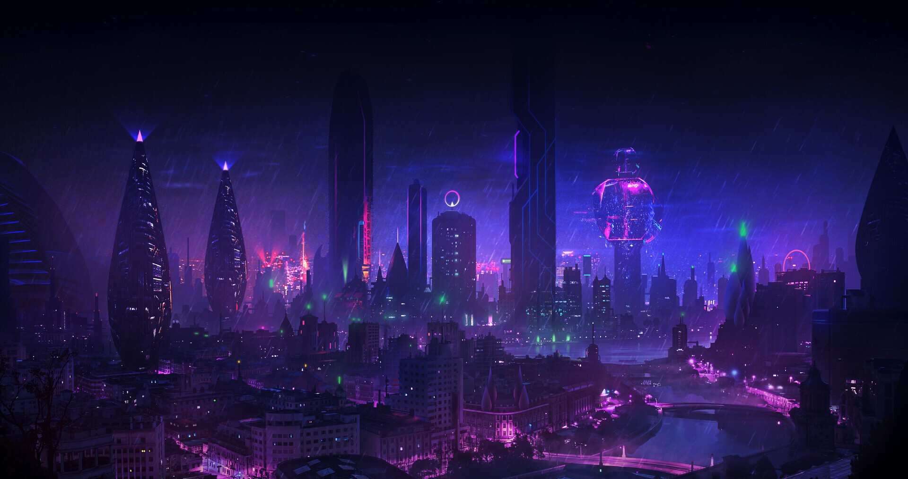

# mydots - Cyberpunk Hyprland Rice

A fully dynamic, cyberpunk-themed Hyprland configuration with purple/pink aesthetics, animated wallpapers, system monitoring, and auto-detection for NVIDIA GPUs.



## Features

- **Cyberpunk purple/pink color scheme** (Rose Pine inspired)
- **Animated live wallpapers** from Google Drive
- **Auto-detecting NVIDIA driver installer** - Works with all GPU generations
- **Three install modes** - Fresh, Full, or Minimal installation
- **System monitoring** (CPU, Memory, Disk, Network) in Waybar & btop
- **Notification daemon** (mako) with cyberpunk styling
- **Screenshot tools** (grim + slurp) with keybindings
- **Clipboard history** (cliphist) with wofi picker
- **Auto-lock** (hypridle) after idle time
- **SDDM display manager** with astronaut theme
- **Smooth animations** and blur effects
- **PipeWire audio** (modern replacement for PulseAudio)

## Quick Start

### Fresh Arch Linux Install (Terminal Only)

```bash
# 1. Install git
sudo pacman -S git

# 2. Clone and install
git clone https://github.com/iceyxsm/mydots.git
cd mydots
chmod +x install.sh
./install.sh        # Default: Full install

# 3. Reboot
sudo reboot
```

## Install Modes

The installer supports three modes for different needs:

### `--finstall` - Fresh Install (Nuclear Option)
🔥 **WARNING**: This deletes everything and starts fresh!

```bash
./install.sh --finstall
```

- Removes ALL packages except base, git, pacman, yay
- Deletes all configs in `~/.config/`
- Cleans themes, icons, wallpapers
- Installs everything fresh
- Type `NUKE` to confirm

### `-finstall` - Full Install (Default)
📦 Standard installation with backup.

```bash
./install.sh -finstall    # or just ./install.sh
```

- Backs up existing configs (timestamped)
- Installs all packages
- Copies all cyberpunk configs
- Downloads live wallpapers
- Perfect for first-time setup

### `-minstall` - Minimal Install
📝 Preserves existing setup, only adds missing.

```bash
./install.sh -minstall
```

- Keeps existing packages and configs
- Only installs missing packages
- Skips wallpaper download
- Great for updates or fixing missing tools

## What's Included

### Core Components
| Component | Purpose |
|-----------|---------|
| **Hyprland** | Wayland compositor with animations |
| **Waybar** | Status bar with system monitoring |
| **Kitty** | GPU-accelerated terminal |
| **SDDM** | Display manager with astronaut theme |
| **Hyprpaper** | Wallpaper daemon |
| **Hyprlock** | Lock screen (SUPER+L) |
| **Hypridle** | Auto-lock after idle |

### System Tools
| Tool | Purpose |
|------|---------|
| **btop** | System resource monitor |
| **neofetch** | System info display |
| **mako** | Notification daemon |
| **grim + slurp** | Screenshots |
| **cliphist** | Clipboard history |
| **wofi** | Application launcher |
| **thunar** | File manager |
| **pavucontrol** | Audio control |

### GPU Support

**Auto-detected and installed:**

| GPU Series | Driver Installed |
|------------|------------------|
| RTX 5000 (Blackwell) | `nvidia-open-dkms` |
| RTX 4000 (Ada) | `nvidia-open-dkms` |
| RTX 3000/2000 (Ampere/Turing) | `nvidia-dkms` |
| GTX 1000/900 (Pascal/Maxwell) | `nvidia-dkms` |
| GTX 600/700 (Kepler) | `nvidia-470xx-dkms` (AUR) |
| Intel/AMD | `mesa` + `vulkan` |

## Keybindings

### Window Management
| Keybind | Action |
|---------|--------|
| `SUPER + Return` | Open terminal (kitty) |
| `SUPER + Q` | Close window |
| `SUPER + M` | Exit Hyprland |
| `SUPER + V` | Toggle floating |
| `SUPER + D` | App launcher (wofi) |
| `SUPER + E` | File manager (thunar) |

### Navigation
| Keybind | Action |
|---------|--------|
| `SUPER + Arrow Keys` | Move focus |
| `SUPER + 1-5` | Switch workspace |
| `SUPER + SHIFT + 1-5` | Move window to workspace |
| `SUPER + Mouse Left` | Move window |
| `SUPER + Mouse Right` | Resize window |

### Utilities
| Keybind | Action |
|---------|--------|
| `SUPER + L` | Lock screen (hyprlock) |
| `SUPER + Print` | Screenshot (full screen) |
| `SUPER + SHIFT + S` | Screenshot (region) |
| `SUPER + V` | Clipboard history picker |

## Configuration

All configs are in `~/.config/`:

```
~/.config/
├── hypr/
│   ├── hyprland.conf      # Main compositor config
│   ├── hyprpaper.conf     # Wallpaper config
│   ├── hyprlock.conf      # Lock screen config
│   ├── hypridle.conf      # Auto-lock config
│   └── wallpapers/        # All wallpapers
│       ├── live-wallpapers/
│       ├── dark-theme/
│       └── light-theme/
├── waybar/
│   ├── config             # Bar modules
│   └── style.css          # Cyberpunk styling
├── kitty/
│   └── kitty.conf         # Terminal config
├── btop/
│   ├── btop.conf
│   └── themes/cyberpunk.theme
├── mako/
│   └── config             # Notifications
└── neofetch/
    └── config.conf
```

## Theme Colors

Rose Pine cyberpunk palette:

| Color | Hex | Usage |
|-------|-----|-------|
| **Purple** | `#c4a7e7` | Primary accent |
| **Pink** | `#eb6f92` | Secondary accent |
| **Cyan** | `#9ccfd8` | Highlights, CPU |
| **Yellow** | `#f6c177` | Memory, battery |
| **Background** | `#191724` | Dark bg |
| **Foreground** | `#e0def4` | Text |

## Post-Installation

### Connect to WiFi
```bash
nmtui              # TUI network manager
# or click network icon in Waybar
```

### Test the setup
```bash
btop               # System monitor
neofetch           # System info
hyprctl version    # Hyprland version
nvidia-smi         # If NVIDIA GPU
```

### Change wallpaper
Edit `~/.config/hypr/hyprpaper.conf`:
```bash
preload = ~/.config/hypr/wallpapers/dark-theme/dark-wall1.jpg
wallpaper = ,~/.config/hypr/wallpapers/dark-theme/dark-wall1.jpg
```

## Troubleshooting

### No WiFi
```bash
# Enable NetworkManager
sudo systemctl enable --now NetworkManager

# Check WiFi device
iw dev
```

### No audio
```bash
# Check PipeWire status
systemctl --user status pipewire

# Restart audio
systemctl --user restart pipewire pipewire-pulse wireplumber
```

### NVIDIA issues
```bash
# Check if driver loaded
nvidia-smi

# Check logs
sudo dmesg | grep -i nvidia

# For manual install
./install-nvidia.sh
```

### Waybar not showing
```bash
killall waybar
waybar &
```

### Wallpapers not loading
```bash
# Manual download
# Link: https://drive.google.com/drive/folders/1oS6aUxoW6DGoqzu_S3pVBlgicGPgIoYq
# Place in: ~/.config/hypr/wallpapers/live-wallpapers/
```

## Scripts

| Script | Purpose |
|--------|---------|
| `install.sh` | Main installer (3 modes) |
| `install-nvidia.sh` | Standalone NVIDIA installer |

## Requirements

- Arch Linux (or Arch-based distro)
- Internet connection
- `sudo` access
- Git

## Credits

- Color scheme: [Rose Pine](https://rosepinetheme.com/)
- Inspiration: [StealthIQ/dotfiles](https://github.com/StealthIQ/dotfiles)
- Hyprland: [hyprland.org](https://hyprland.org/)

## License

MIT - Do whatever you want with this.

---

**Enjoy your cyberpunk rice!** 🌸✨
